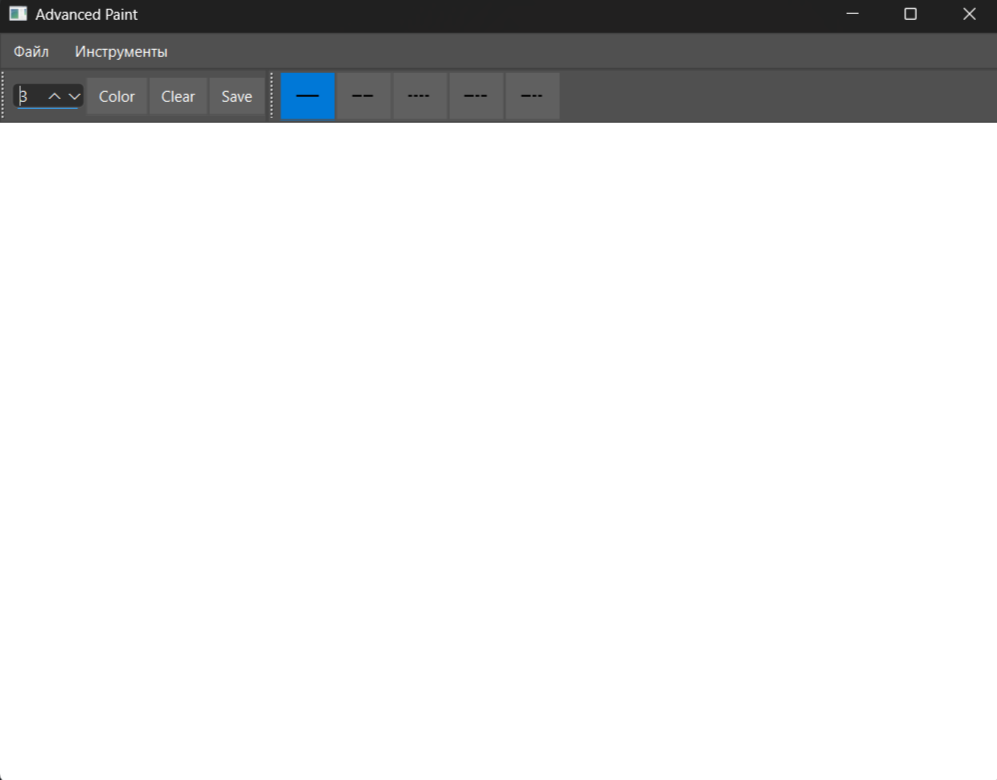
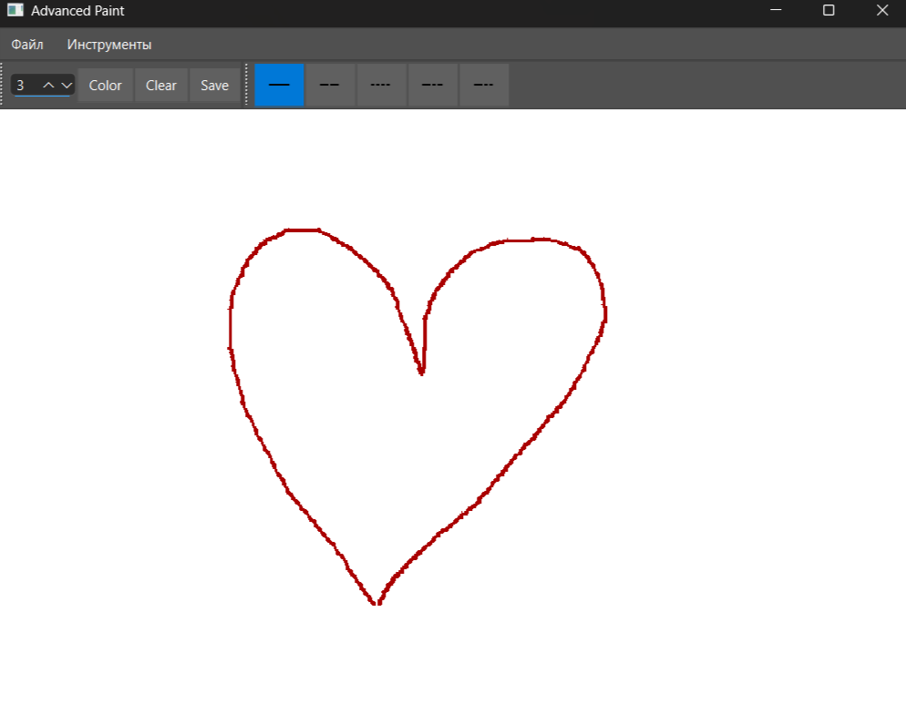
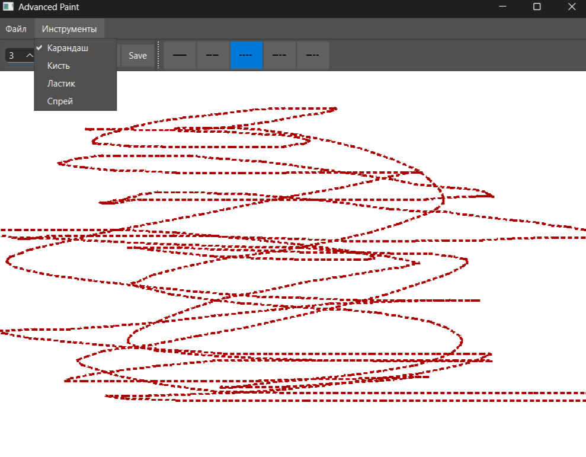

# 🎨 Paint - Инструмент для рисования

## 📌 Основные возможности

- **Инструменты рисования**:
  - ✏️ Карандаш (тонкие линии)
  - 🖌️ Кисть (толстые линии)
  - 🧽 Ластик (стирание)
  - 💨 Спрей (эффект распыления)

- **Настройки**:
  - 🎨 Выбор цвета (палитра)
  - 📏 Изменение толщины (1-50px)
  - 🖍️ Стили линий: 
    - Сплошная (`———`)
    - Пунктир (`- - -`)
    - Точечная (`•••••`)
    - Штрих-пунктир (`-•-•-`)

## 🖼️ Скриншоты интерфейса

### Главное окно


### Примеры
| Инструмент | Пример |
|------------|--------|
| Карандаш |  |
| Панель |  

## 🚀 Быстрый старт

```bash
# Для разработчиков
git clone https://github.com/BogdanPryadko4853/pain
cd paint && mkdir build && cd build
cmake .. && make
./paint
